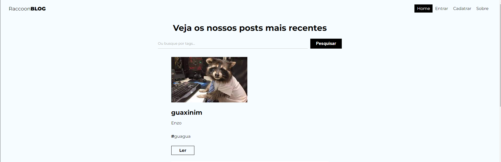

# Raccom Blog

O Raccom Blog é uma plataforma de blogging que combina um front-end desenvolvido com React e um backend hospedado no Firebase. Esta aplicação oferece uma experiência completa para os usuários, permitindo-lhes registrar-se, fazer login de forma segura, criar e compartilhar posts com texto e imagens. Além disso, inclui um painel de controle intuitivo para a gestão de posts.

Características Principais
Autenticação de Usuário: Utilizando o Firebase Authentication, os usuários podem se cadastrar e fazer login de forma segura.

Publicação de Conteúdo: Os usuários têm a capacidade de criar e compartilhar postagens, incluindo texto e imagens.

Painel de Controle: Um painel administrativo permite que os usuários autorizados gerenciem suas postagens, editando ou excluindo conforme necessário.

## Tech Stack

React: Uma biblioteca JavaScript de código aberto para a construção de interfaces de usuário.

Firebase: Uma plataforma de desenvolvimento de aplicativos móveis e web desenvolvida pelo Google. No caso deste projeto, é utilizado para o armazenamento de dados, autenticação de usuários e hospedagem do backend.

## Link

- [Deploy-Site](https://racoomblog.netlify.app/)

## Rodar localmente

Clone o projeto

```bash
  git clone https://link-to-project
```

Vá até o projeto

```bash
  cd my-project
```

Instales as dependências

```bash
  npm install
```

Rode

```bash
  npm run dev 
```

## Screenshot


## Authors

- [@enzoshiotuqui](https://github.com/EnzoShiotuqui)

